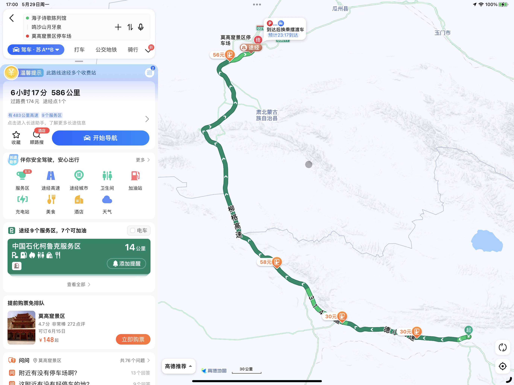
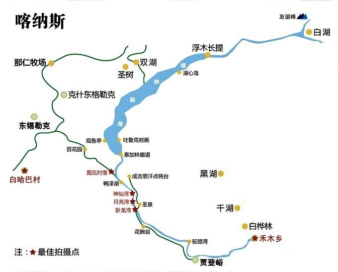
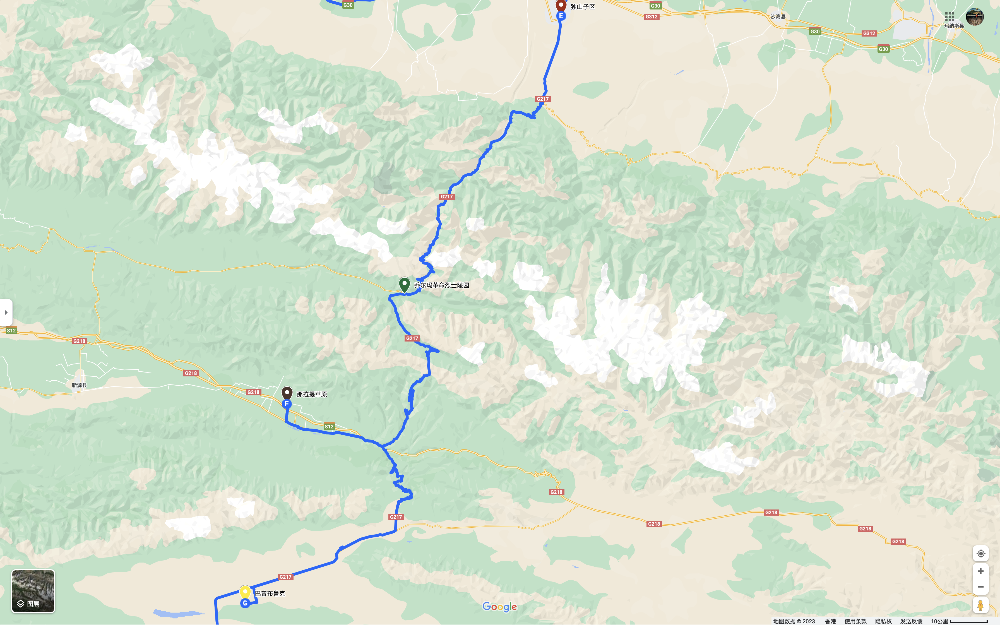

# 西出阳关
- [日程](#日程)
	- [Day1 6/03 南京 -\> 兴平](#day1-603-南京---兴平)
	- [Day2 6/04 兴平 -\> 定西 -\> 兰州 -\> 兰州红古区](#day2-604-兴平---定西---兰州---兰州红古区)
	- [Day3 6/05 红古区 -\> 青海湖（午饭） -\> 德令哈 -\> 大柴旦](#day3-605-红古区---青海湖午饭---德令哈---大柴旦)
	- [Day4 6/06 大柴旦 -\> 敦煌(午饭) -\> 哈密（晚饭） -\> 巴里坤](#day4-606-大柴旦---敦煌午饭---哈密晚饭---巴里坤)
	- [Day5 6/07 巴里坤 -\> 昌吉（午饭） -\> 富蕴（晚饭）](#day5-607-巴里坤---昌吉午饭---富蕴晚饭)
	- [Day6 6/08 富蕴 -\> 克兰河 -\> 布尔津 -\> 贾登峪](#day6-608-富蕴---克兰河---布尔津---贾登峪)
	- [Day7 6/09 贾登峪 -\> 喀纳斯（图瓦村）-\> 贾登峪](#day7-609-贾登峪---喀纳斯图瓦村--贾登峪)
	- [Day8 6/10 贾登峪 -\> 禾木 -\> 哈巴河 -\> 吉木乃 -\> 和布克塞尔](#day8-610-贾登峪---禾木---哈巴河---吉木乃---和布克塞尔)
	- [Day9 6/11 和布克塞尔 -\> 博乐](#day9-611-和布克塞尔---博乐)
	- [Day10 6/12 博乐 -\> 赛里木湖 -\> 独山子](#day10-612-博乐---赛里木湖---独山子)
	- [Day11 6/13 独山子 -\> 那拉提 -\> 巴音布鲁克](#day11-613-独山子---那拉提---巴音布鲁克)
	- [Day12 6/14 巴音布鲁克 -\> 库车 -\> 阿克苏](#day12-614-巴音布鲁克---库车---阿克苏)
	- [Day13 6/15 阿克苏 -\> 喀什 -\> 叶城](#day13-615-阿克苏---喀什---叶城)
	- [Day14 6/16 叶城 -\> 六三五道班](#day14-616-叶城---六三五道班)
	- [Day15 6/17 六三五道班 -\> 普兰县巴嘎乡](#day15-617-六三五道班---普兰县巴嘎乡)
	- [Day16 6/18 巴嘎乡 -\> 萨嘎县](#day16-618-巴嘎乡---萨嘎县)
	- [Day17 6/19 萨嘎县 -\> 定日县](#day17-619-萨嘎县---定日县)
	- [Day18 6/20 定日县 -\> 拉孜县](#day18-620-定日县---拉孜县)
	- [Day19 6/21 拉孜县 -\> 拉萨](#day19-621-拉孜县---拉萨)
	- [Day20 6/22 拉萨 -\> 纳木错 -\> 拉萨](#day20-622-拉萨---纳木错---拉萨)
	- [Day21 6/23 拉萨 -\> 索松村](#day21-623-拉萨---索松村)
	- [Day22 6/24 索松村 -\> 八宿县](#day22-624-索松村---八宿县)
	- [Day23 6/25 八宿县 -\> 巴塘县](#day23-625-八宿县---巴塘县)
	- [Day24 6/26 巴塘县 -\> 雅江](#day24-626-巴塘县---雅江)
	- [Day25 6/27 雅江 -\> 重庆](#day25-627-雅江---重庆)
	- [Day26 6/28 重庆 -\> 三峡](#day26-628-重庆---三峡)
	- [Day27 6/29 三峡 -\> 南京](#day27-629-三峡---南京)
- [检查列表](#检查列表)
	- [公共](#公共)
		- [车辆](#车辆)
		- [药品](#药品)
		- [食品](#食品)
		- [工具](#工具)
		- [洗漱防护](#洗漱防护)
	- [个人](#个人)
		- [证件](#证件)
		- [衣物](#衣物)
		- [洗漱防护](#洗漱防护-1)
		- [电子产品](#电子产品)

## 路线图及途径点

* PlanA备用时间：4天
* 出发前检查见：[检查列表](#检查列表)

## 日程

### Day1 6/03 南京 -> 兴平
#### 每日巡检
* [ ] 独库北段是否开通
* [ ] 独库南段铁力买提隧道是否开放
* [ ] 巴塘至理塘段是否放行
#### 今日行程
距离|时长|费用
-|-|-
1384km|13h56m|688

#### 注意事项
* 全椒：定位
* 副驾预估时间提前预定旅馆
* ⚠️暴雨+秦岭山雾+隧道车祸堵车：使用1天备用时间

### Day2 6/04 兴平 -> 定西 -> 兰州 -> 兰州红古区
#### 每日巡检
* [ ] 独库北段是否开通
* [ ] 独库南段铁力买提隧道是否开放
* [ ] 巴塘至理塘段是否放行
#### 今日行程
距离|时长|费用
-|-|-
1047km|12h20m|362

#### 注意事项
* 平凉：定位+开图来平凉@平凉一把刀
* 定西：定位+《定西》截图
* * 定西北拍照，日后跟镇江南同框
* 兰州：定位+《兰州》
* 夜宿兰州红古区，天黑前可达，第二天节约2小时。

### Day3 6/05 红古区 -> 青海湖（午饭） -> 德令哈 -> 大柴旦
#### 每日巡检
* [ ] 独库北段是否开通
* [ ] 独库南段铁力买提隧道是否开放
* [ ] 巴塘至理塘段是否放行
#### 今日行程
距离|时长|费用
-|-|-
1047km|12h20m|362

#### 注意事项
* 青海湖沿途拍照视频注意时间
* * 青海湖：选美中国特刊P 合影
* * 青海湖黑马河镇午饭，选择丰富羊肉很嫩
* 德令哈：定位+《姐姐今夜我在德令哈》， 游览海子诗歌陈列馆
* 前往大柴旦，副驾提前预定德令哈旅馆

### Day4 6/06 大柴旦 -> 敦煌(午饭) -> 哈密（晚饭） -> 巴里坤
#### 每日巡检
* [ ] 独库北段是否开通
* [ ] 独库南段铁力买提隧道是否开放
* [ ] 巴塘至理塘段是否放行
#### 今日行程
距离|时长|费用
-|-|-
586km|6h17m|174

#### 注意事项
* 顺路经过鸣沙山可短暂驻足
* 莫高窟只允许停车后乘车前往，游览指定路线时常约3小时
* * ⚠️注意：莫高窟至少提前三天预定，且只能网上预定。
* 副驾可在路途中早早预定旅馆

### Day5 6/07 巴里坤 -> 昌吉（午饭） -> 富蕴（晚饭）
#### 每日巡检
* [ ] 独库北段是否开通
* [ ] 独库南段铁力买提隧道是否开放
* [ ] 巴塘至理塘段是否放行
#### 今日行程
距离|时长|费用
-|-|-
1278km|13h32m|479

#### 注意事项
* 副驾观察进度，预计如期抵达则提前定旅馆。

### Day6 6/08 富蕴 -> 克兰河 -> 布尔津 -> 贾登峪
#### 每日巡检
* [ ] 独库北段是否开通
* [ ] 独库南段铁力买提隧道是否开放
* [ ] 巴塘至理塘段是否放行
#### 今日行程
距离|时长|费用
-|-|-
537km|7h57m|76

#### 注意事项
* 海子口水库：额尔齐斯河源头至北冰洋的问候(北冰洋、露营椅🍻)
* 塔斯塔克（克兰河1号大桥）/铁根托别：定位+《克兰河》截图
* 布尔津五彩滩：额尔齐斯河（北冰洋、至北冰洋的问候）
* 副驾查询喀纳斯住宿及门票

### Day7 6/09 贾登峪 -> 喀纳斯（图瓦村）-> 贾登峪
#### 每日巡检
* [ ] 独库北段是否开通
* [x] 独库南段铁力买提隧道是否开放
* [ ] 巴塘至理塘段是否放行
#### 今日行程

#### 注意事项
* 喀纳斯：定位+睡眠白噪音app截图
* 喀纳斯新G219路碑0公里：G219特刊、最美公路G219页
* 拍摄雾气峡谷：神仙湾 —乘车-> 月亮湾 -雾气消散-> 卧龙湾
* 观鱼亭：坐车至半山腰登顶俯瞰全景
* 图瓦村：如果预定得到则住宿此地，否则去贾登峪

### Day8 6/10 贾登峪 -> 禾木 -> 哈巴河 -> 吉木乃 -> 和布克塞尔
#### 每日巡检
* [ ] 独库北段是否开通
* [x] 独库南段铁力买提隧道是否开放
* [ ] 巴塘至理塘段是否放行
#### 今日行程
距离|时长|费用
-|-|-
416km|7h10m|21

#### 注意事项
* 白哈巴村：边境村落 / 禾木村：白桦林
* 如果第一天浏览顺利，且对白哈巴和禾木村不感兴趣，可以考虑只玩一天第二天走G219去赛里木湖。

### Day9 6/11 和布克塞尔 -> 博乐
#### 每日巡检
* [ ] 独库北段是否开通
* [x] 独库南段铁力买提隧道是否开放
* [ ] 巴塘至理塘段是否放行
#### 今日行程
距离|时长|费用
-|-|-
870km|9h31m|235

#### 注意事项
* 副驾预定博乐住宿

### Day10 6/12 博乐 -> 赛里木湖 -> 独山子
#### 每日巡检
* [ ] 独库北段是否开通
* [x] 独库南段铁力买提隧道是否开放
* [ ] 巴塘至理塘段是否放行
#### 今日行程
距离|时长|费用
-|-|-
398km|4h26m|108

#### 注意事项
* 赛里木湖咨询是否允许自驾
* 赛里木湖东门进逆时针游玩，南门结束后使用套票回到东门。
* 在东侧拍照山和湖同框照片（来自大西洋的问候，到此为止）
* 时间允许在果子沟山顶拍摄赛里木湖
* 离开赛里木后副驾预定独山子住宿

### Day11 6/13 独山子 -> 那拉提 -> 巴音布鲁克
#### 每日巡检
* [x] 独库南段铁力买提隧道是否开放
* [ ] 巴塘至理塘段是否放行
#### 今日行程
距离|时长|费用
-|-|-
-km|-h|-

#### 注意事项
* 最美公路特刊G217分段
* 路过那拉提，游玩巴音布鲁克
* 草原雪山：塞尔达开场合影
* 副驾查询巴音布鲁克住宿及门票
* 查询第二日铁力买提达坂是否要求防滑链

### Day12 6/14 巴音布鲁克 -> 库车 -> 阿克苏
#### 每日巡检
* [ ] 巴塘至理塘段是否放行
#### 今日行程
距离|时长|费用
-|-|-
302km|4h53m|20

#### 注意事项
* 打卡
* * 巴音布鲁克湿地：选美中国P386
* * 库车大峡谷：G219特刊封面
* * 库车大峡谷：选美中国P182
* 提前联系阿克苏4S店保养
* 副驾查询库车住宿

### Day13 6/15 阿克苏 -> 喀什 -> 叶城
#### 每日巡检
* [ ] 巴塘至理塘段是否放行
#### 今日行程
距离|时长|费用
-|-|-
771km|7h48m|217

#### 注意事项
* 抵达后先保养，告知计划走新藏线入藏
* 咨询新藏线当前天气及路况，是否需要防滑链
* 天未黑则打卡老219新藏线0公里路碑

### Day14 6/16 叶城 -> 六三五道班
#### 每日巡检
* [ ] 巴塘至理塘段是否放行
#### 今日行程
距离|时长|费用
-|-|-
658km|11h30m|0

#### 注意事项
* 打卡
* * 老219新藏线0公里路碑
* * 乔戈里峰：选美中国P58
* 冻土路段非铺装
* 麻扎（叶尔羌河处）注意观察：西南方向可拍摄乔戈里峰（2nd）、布洛阿特峰（12th）
* 到达三十里营房观察整体状况，考虑住宿。第二天去日土，第三天再去巴嘎乡。
* 烈士陵园
* 康西瓦达坂
* 本日存在道班满载不对外提供住宿可能，准备厚睡袋睡车里（窗户留缝交换氧气）

### Day15 6/17 六三五道班 -> 普兰县巴嘎乡
#### 每日巡检
* [ ] 巴塘至理塘段是否放行
#### 今日行程
距离|时长|费用
-|-|-
656km|8h51m|0

#### 注意事项
* 出发后经过众多小湖（一措再措）
* 界山达坂：最高达坂
* 班公错
* 日土县：午饭
* 4个5000米以上的达坂，300公里行走在天之巅（而世之奇伟、瑰怪，非常之观，常在于险远）
* 巴嘎乡：北方有冈仁波齐（众神居所是否拥挤：藏传佛教、苯教、印度教和古耆那教），南方有拉昂错、玛旁雍错和纳木那尼峰

### Day16 6/18 巴嘎乡 -> 萨嘎县
#### 每日巡检
* [ ] 巴塘至理塘段是否放行
#### 今日行程
距离|时长|费用
-|-|-
602km|7h54m|0

#### 注意事项
* 打卡
* * 冈仁波齐：选美中国P66
* 冈仁波齐（众神居所是否拥挤：藏传佛教、苯教、印度教和古耆那教）
* 吉悟寺：山和湖，山只露一些
* 楚布寺观景台/楚果寺：山和湖同框
* 霍尔乡：翻过垭口为冈仁波齐远景拍摄地
* 公珠措
* 仲巴县城外：安娜普纳尔峰（10th）、道拉吉利峰（7th）

### Day17 6/19 萨嘎县 -> 定日县
#### 每日巡检
* [ ] 巴塘至理塘段是否放行
#### 今日行程
距离|时长|费用
-|-|-
535km|8h40m|0

#### 注意事项
* 打卡
* * 冈仁波齐：选美中国P66
* 佩枯措：东侧希夏邦玛峰(14th)观景台
* 孔唐拉姆山口：马纳斯鲁峰（8th）
* 中尼友谊桥：G318终点（人民广场同款boost），景观大道特刊合影

### Day18 6/20 定日县 -> 拉孜县
#### 每日巡检
* [ ] 巴塘至理塘段是否放行
#### 今日行程
距离|时长|费用
-|-|-
207km|3h44m|0

#### 注意事项
* 打卡
* * 珠穆朗玛：选美中国P40
* * 绒布冰川：选美中国P290
* 珠峰观景台：等待拍照时机，开火午饭。如果有云则直奔珠峰大本营，回头再来拍日落。
* 珠峰大本营：2-3h拍照
* pic0:群峰（马卡鲁峰（5th），洛子峰（4th），珠峰（1st），卓奥友峰（6th），希夏邦玛峰（14th））
* pic1:桌椅、午饭、下午茶等珠峰拨云见日
* pic2:在珠峰之上🍻

### Day19 6/21 拉孜县 -> 拉萨
#### 每日巡检
* [ ] 巴塘至理塘段是否放行
#### 今日行程
距离|时长|费用
-|-|-
497km|8h19m|0

#### 注意事项
* 干城章嘉峰（3rd）：一路寻找角度，如果时间天气允许则绕道岗巴县观景台
* G318：5000公里路碑
* 日喀则：午饭
* 途径羊卓雍错随手拍不特别规划

### Day20 6/22 拉萨 -> 纳木错 -> 拉萨
#### 每日巡检
* [ ] 巴塘至理塘段是否放行
#### 今日行程
距离|时长|费用
-|-|-
373km|4h44m|0

#### 注意事项
* 打卡
* * 纳木错：选美中国P92
* 布达拉宫：与50元纸币合影
* 布达拉宫：相机贴地，倒水拍倒影

### Day21 6/23 拉萨 -> 索松村
#### 每日巡检
* [ ] 巴塘至理塘段是否放行
#### 今日行程
距离|时长|费用
-|-|-
481km|5h29m|0

#### 注意事项
* 打卡
* * 雅鲁藏布大峡谷：选美中国P152
* * 南迦巴瓦：选美中国P26
* 派镇：考虑是否在此住宿而不是索松村？
* 南迦巴瓦观景台：等待机缘看南迦巴瓦以及日照金山（选美中国特刊最美山峰）

### Day22 6/24 索松村 -> 八宿县
#### 每日巡检
* [ ] 巴塘至理塘段是否放行
#### 今日行程
距离|时长|费用
-|-|-
514km|9h32m|0

#### 注意事项
* 打卡
* * 南迦巴瓦：选美中国P26
* * 波密县岗云杉林：选美中国P328
* * 波密县玉普乡米堆冰川：选美中国P302
* 色季拉山口： 正东方向拍摄南迦巴瓦峰
* 老虎口：此处多塌方，路况较差。仔细观察，快速通行。

### Day23 6/25 八宿县 -> 巴塘县
#### 每日巡检
* [ ] 巴塘至理塘段是否放行
#### 今日行程
距离|时长|费用
-|-|-
456km|9h24m|0

#### 注意事项
* 怒江72拐：反向走下坡与常规路线相反，注意观察刹车过热。动能回收满后使用B档发动机辅助减速。
* 邦达草原观景点
* 东达山垭口

### Day24 6/26 巴塘县 -> 雅江
#### 每日巡检
* [ ] 巴塘至理塘段是否放行
#### 今日行程
距离|时长|费用
-|-|-
598km|10h12m|0

#### 注意事项
* 318：5.26-6.15再次维修，存在限时放行或单向放行
* 理塘：谁人不识理塘王.jpg（花一分钱都是对他们行为的认可）
* 海子山国家公园：200610期景观大道特刊封面
* 如日程吃紧则使用备用时间途中住宿

### Day25 6/27 雅江 -> 重庆
#### 今日行程
距离|时长|费用
-|-|-
672km|8h49m|319

#### 注意事项
* 打卡
* * 贡嘎雪山：选美中国P34
* * 甘孜藏族丹巴藏寨：选美中国P490
* * 甘孜州海螺沟冰川：选美中国P300
* 路过贡嘎雪山观景台

### Day26 6/28 重庆 -> 三峡
#### 今日行程
距离|时长|费用
-|-|-
733km|8h53m|420

#### 注意事项
* 打卡
* * 三峡：选美中国P162
* 三峡大坝风景区

### Day27 6/29 三峡 -> 南京
#### 今日行程
距离|时长|费用
-|-|-
749km|8h28m|345

## 检查列表
[返回首页](#路线图及途径点)

### 公共

* [x] 离线地图下载

#### 车辆

* [x] 行驶证
* [x] 备用钥匙
* [x] 充气泵
* [x] 接电宝
* [x] 出发前保养、备胎、千斤顶、备用套筒
* [x] 空调滤、空气滤
* [ ] 防滑链
* [ ] 入藏前保养

#### 药品

* [x] 红景天30粒 * 1盒、口服液10支 * 4盒
* [x] 对乙酰氨基酚12片 * 2盒
* [x] 布洛芬缓释24颗 * 2盒
* [x] 布洛芬12片 * 1板
* [x] 塞来昔布胶囊12粒 * 1瓶
* [x] 罗红霉素36颗 * 2盒
* [x] 蒙脱石散15袋 * 2盒
* [x] 肠炎宁48片 * 1盒
* [x] 复方熊胆薄荷含片48片 * 1盒
* [x] 复方冬凌草含片48片 * 1盒
* [x] 退热贴6片 * 1盒
* [x] 咳克平24片 * 1盒
* [x] VC咀嚼片60片 * 2盒
* [x] 21金维他30片 * 1盒
* [x] 葡萄糖电解质冲剂3袋 * 6盒
* [x] 创口贴20片 * 1盒
* [x] 家用急救包 * 1
* [x] 樟脑乳膏（皮炎）* 1盒
* [x] 利多卡因氯己定喷雾 * 1盒
* [x] 晕车贴6片 * 1盒
* [x] 氧气罐960ml * 9罐
* [x] 急救毯 * 1打

#### 食品

* [x] 矿泉水4L * 1桶
* [ ] 矿泉水 * 1箱
* [x] 垃圾袋1卷 * 3卷
* [x] 90压缩饼干250g * 20袋
* [x] 红烧肉罐头500g * 3罐
* [x] 速食拉面2份 * 6袋
* [x] 方便面5袋 * 6包

#### 工具

* [x] 腰靠、U型枕
* [x] 折叠椅（快叠长 * 1、快叠短 * 1、轻量长 * 1、轻量短 * 1）
* [x] 折叠桌 * 1
* [x] 高山气罐G2 * 8罐、G5 * 1罐
* [x] 一体式炉头（电打火）* 1
* [x] 分体式炉头（电打火）* 1
* [x] 折叠防风板 * 1
* [x] 钛锅 * 2
* [x] 钛杯 * 2
* [x] 伞 * 2
* [x] 运动相机、支架
* [x] 相机、云台、sd卡
* [x] 保温杯 * 1
* [x] 保温水壶 * 2
* [x] 移动硬盘（2T * 1、1T * 1、250G * 1）
* [x] 工兵铲

#### 洗漱防护

* [x] 防晒霜60ml * 3瓶
* [x] 防晒喷雾320ml * 1瓶
* [x] 水喷雾50ml * 1瓶
* [x] 口罩 * 100片
* [x] 牙线 * 100根
* [x] 手套 * 2双
* [x] 一次性毛巾（1卷、若干规格压缩毛巾）
* [x] 湿厕纸40片 * 9包

### 个人

#### 证件

* [ ] 驾驶证（清分、绑定车辆）
* [ ] 身份证
* [ ] 边防证
* [ ] 现金～1000（备一张50元纸币拍布达拉宫）

#### 衣物

* [ ] 内裤 * 30
* [ ] 袜子 * 30
* [ ] 汗衫 * 30
* [ ] 保暖内衣 * 5套
* [ ] 春秋外套 * 2
* [ ] 冬外套 * 2
* [ ] 单鞋 * 3双
* [ ] 厚鞋 * 1双
* [ ] 拖鞋 * 1双
* [ ] 睡袋内胆 * 1
* [ ] 厚睡袋 * 1
* [ ] 游泳包/随身包（收纳洗漱及当日换洗衣物）

#### 洗漱防护

* [ ] 防晒袖套 * 1对
* [ ] 墨镜 * 1
* [ ] 面罩 * 1
* [ ] 牙膏、牙刷、冲牙器
* [ ] 洗发水、护发素、洗面奶、沐浴乳
* [ ] 帽子 * 1

#### 电子产品

* [ ] 移动电源
* [ ] 充电器
* [ ] 电脑
* [ ] 平板
* [ ] 手机
